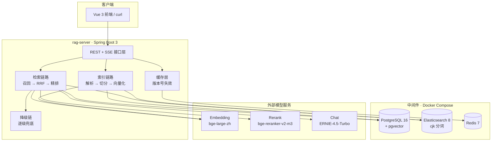
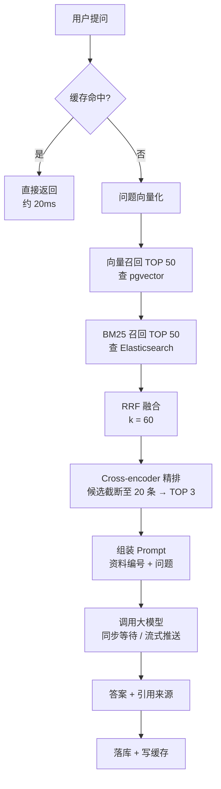
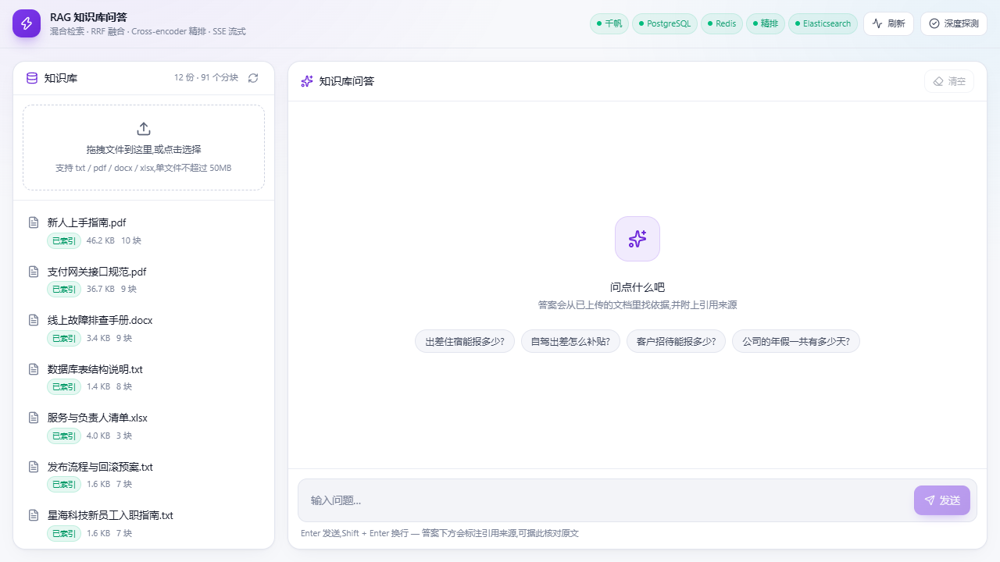
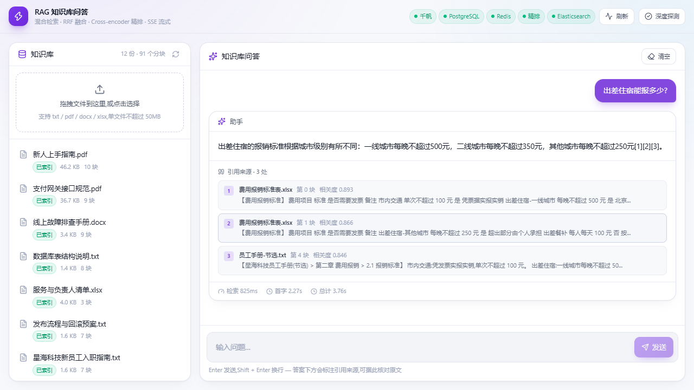

# RAG 知识库问答系统


一套面向企业文档的检索增强生成（RAG）系统。支持上传 txt / PDF / Word / Excel
文档，按标题层级切分并建立索引，用自然语言提问后返回带引用来源的回答。

后端基于 Spring Boot 3，采用 pgvector 向量召回 + Elasticsearch BM25 关键词召回
的双路检索，经 RRF 融合与 Cross-encoder 精排后交给大模型生成答案；配套 Vue 3
前端，支持流式输出。全套依赖由 Docker Compose 编排，一条命令启动。

**核心指标**：在 12 份文档 / 91 个分块的语料、150 条自建评测集上，
Hit@1 从单路向量的 83.1% 提升至 97.7%，MRR 从 0.9050 提升至 0.9885。

---

## 目录

- [功能特性](#功能特性)
- [系统架构](#系统架构)
- [检索流程](#检索流程)
- [技术栈](#技术栈)
- [快速开始](#快速开始)
- [使用示例](#使用示例)
- [接口文档](#接口文档)
- [效果评测](#效果评测)
- [项目结构](#项目结构)
- [技术文档](#技术文档)
- [Roadmap](#roadmap)
- [已知限制](#已知限制)

---

## 功能特性

| 模块 | 能力 |
|---|---|
| 文档接入 | txt / pdf / docx / xlsx 多格式解析，Apache Tika 按文件头识别格式；纯文本走自研编码探测，兼容 GBK/GB18030 |
| 文本切分 | 识别「第 X 章 / 1.1」标题层级，标题作为面包屑前缀拼入正文；chunk 大小、重叠、标题判定长度均为配置项 |
| 向量检索 | pgvector 存储 1024 维向量，HNSW 索引，余弦距离换算相似度 |
| 关键词检索 | Elasticsearch + cjk 分析器，BM25 打分 |
| 结果融合 | RRF（Reciprocal Rank Fusion）只用排名不用分数，规避两路分数量纲不可比的问题 |
| 精排 | Cross-encoder 对候选逐条打分，候选先截断至 20 条再取 TOP 3 |
| 引用溯源 | 解析答案正文中的 `[1][2]` 标记，只返回真正被引用的来源 |
| 流式输出 | SSE 逐字返回，首字延迟从 3.62s 降至 2.64s |
| 问答缓存 | Redis 缓存 + 知识库版本号失效，重复提问耗时从 4.5s 降至 0.02s |
| 降级容错 | 精排 / 大模型 / 单路召回任一失效均有兜底，降级原因以结构化清单返回 |
| 效果评测 | 150 条中文评测集，支持四种检索配置对比与分块参数实验 |
| 前端 | Vue 3 + TypeScript + Tailwind CSS，支持拖拽上传、流式对话、引用来源展示 |

---

## 系统架构



---

## 检索流程

一次提问的完整链路：



两处容易误读的细节：

- 两路召回是串行编排的，不是并行。向量一路约 500ms（主要是调用 embedding
  接口），BM25 一路约 20ms，并行最多节省 20ms，为 4% 的收益引入并发复杂度
  并不划算。
- BM25 不需要向量化。它直接使用问题原文检索 ES，因此不依赖上一步的输出，
  串行只是编排选择而非数据依赖。

---

## 技术栈

| 层次 | 组件 | 版本 | 选型说明 |
|---|---|---|---|
| 语言与框架 | Java / Spring Boot | 17 / 3.5.7 | LangChain4j 主力 starter 基于 Boot 3；Boot 4 生态尚未成熟 |
| 关系库与向量库 | PostgreSQL + pgvector | 16 | 业务数据与向量检索共用一个组件，无需额外运维向量数据库 |
| 关键词检索 | Elasticsearch | 8.15 | 内置 cjk 分析器按二元组切分中文，无需安装插件；默认 standard 分析器按单字切分会导致 BM25 失效 |
| 缓存 | Redis | 7 | 问答结果缓存，可扩展限流 |
| 文档解析 | Apache Tika | 3.2 | 覆盖 pdf/docx/xlsx，按文件头识别格式 |
| LLM 编排 | LangChain4j | 1.20 | 提供 EmbeddingModel / ChatModel 抽象，更换供应商只改配置 |
| 向量模型 | 百度千帆 bge-large-zh | 1024 维 | 中文检索效果好，提供 OpenAI 兼容接口 |
| 重排序模型 | 硅基流动 bge-reranker-v2-m3 | 568M | 精排为高频小批量调用，中等规模模型性价比更高 |
| 对话模型 | 百度千帆 ernie-4.5-turbo-128k | — | RAG 场景模型主要负责理解资料与组织语言，不需要最强推理能力 |
| 表结构管理 | Flyway | — | 分块表含 vector 字段，JPA 自动建表不可用；Flyway 提供版本记录与可追溯性 |
| 部署 | Docker Compose | — | 一条命令拉起全部中间件与应用 |
| 前端 | Vue 3 + Vite + TypeScript + Tailwind CSS 4 | — | 组合式 API 便于将流式状态抽成 composable |

---

## 快速开始

### 环境要求

| 依赖 | 要求 |
|---|---|
| JDK | 17 |
| Docker | Docker Desktop（Windows 需启用 WSL2） |
| Node.js | 18 及以上（仅前端本地开发需要） |
| API Key | 百度智能云千帆（向量 + 对话）、硅基流动（精排） |

### 1. 配置密钥

复制 `rag-server/application-local.yml`，填入两家平台的 API Key：

```yaml
rag:
  embedding:
    api-key: <千帆 API Key>
  rerank:
    api-key: <硅基流动 API Key>
```

该文件已在 `.gitignore` 中，不会被提交；同时它不在 `src/main/resources`
目录下，避免被一并打入构建产物。

### 2. 启动服务

一键启动（Windows）：双击项目根目录的 `start.cmd`，脚本会依次启动
Docker Desktop、等待后端依赖就绪、启动前端并打开浏览器。

手动启动：

```bash
# 仅启动中间件（应用在 IDE 中以 local profile 运行）
docker compose up -d postgres elasticsearch redis

# 连同应用一起启动
docker compose up -d

# 前端
cd web && npm install && npm run dev
```

首次启动需拉取镜像，耗时约 3~10 分钟。

### 3. 验证部署

Windows 下双击 `verify.cmd` 可执行完整验证；或手动逐条验证：

```bash
# 健康检查：PostgreSQL / Redis / Elasticsearch / 千帆 Key / 硅基流动 Key 应全部为 UP
curl http://localhost:8080/api/system/health

# 上传一份示例文档
curl -F "file=@sample-data/星海科技差旅管理办法.pdf" \
  http://localhost:8080/api/documents

# 提问
curl -X POST http://localhost:8080/api/chat \
  -H "Content-Type: application/json" \
  -d '{"question":"出差住宿能报多少?","sessionId":null}'
```

`verify.cmd` 共执行 11 项检查，分为五组：后端与依赖、知识库内容、
检索精度（含干扰项）、防幻觉、缓存命中。

---

## 使用示例

### 示例文档

`sample-data/` 提供两套可直接导入的文档：

| 目录 | 内容 | 用途 |
|---|---|---|
| `sample-data/` | 6 份企业制度文档（差旅、采购、报销、入职、IT 服务） | 通用问答演示 |
| `sample-data/tech-kb/` | 6 份技术团队文档（接口规范、故障手册、发布流程等） | 检索精度测试 |

第二套文档刻意埋入了相似但不同的干扰项，用于检验检索精度：

| 干扰项 | 出现位置 |
|---|---|
| 支付超时 30 秒 vs 退款超时 60 秒 | 支付网关接口规范 |
| 错误码 3001 余额不足 vs 3002 额度超限 | 接口规范 / 排查手册 |
| 测试环境 3 实例 vs 生产环境 12 实例 | 发布流程与回滚预案 |
| `t_payment`（业务数据）vs `t_payment_log`（流水日志） | 数据库表结构说明 |

### 前端界面

| 知识库列表 | 问答与引用来源 |
|---|---|
|  |  |

前端为 Vue 3 + Vite + TypeScript + Tailwind CSS 4，本地开发方式：

```bash
cd web
npm install
npm run dev     # http://localhost:5173
```

Vite 已将 `/api` 代理至 `localhost:8080`，后端启动后可直接使用。

---

## 接口文档

### 接口列表

| 方法 | 路径 | 说明 |
|---|---|---|
| POST | `/api/documents` | 上传文档（multipart），自动解析、切分、向量化并建立索引 |
| GET | `/api/documents` | 分页列出文档 |
| POST | `/api/documents/{id}/reindex` | 按当前分块策略重新索引 |
| DELETE | `/api/documents/{id}` | 删除文档，同时清理 ES 索引与磁盘文件，并使问答缓存失效 |
| POST | `/api/chat` | 提问，返回答案、引用来源与降级清单 |
| POST | `/api/chat/stream` | 提问，SSE 流式返回 |
| GET | `/api/system/health` | 依赖健康检查 |
| POST | `/api/system/verify` | 校验各模型通道的连通性 |
| GET | `/api/search/bm25` | 调试接口：仅 BM25 召回 |
| GET | `/api/search/hybrid` | 调试接口：双路召回原始结果 |
| GET | `/api/search/fused` | 调试接口：RRF 融合后排名 |
| GET | `/api/search/reranked` | 调试接口：完整检索链路结果 |

四个 `/api/search/*` 调试接口用于观察同一问题在检索各阶段的名次变化。

### 流式接口的事件序列

```
event:meta   data:{"retrievalMs":1482,"hitCount":3}
event:meta   data:{"ttftMs":2638}
event:delta  data:{"text":"出差"}
event:delta  data:{"text":"住宿的"}
...
event:done   data:{"answer":"...","citations":[...],
                   "retrievalMs":1482,"ttftMs":2638,"totalMs":3904,
                   "degraded":false,"degradations":[]}
```

### 降级信息

`degraded` 为 `true` 表示本次结果经过降级，具体环节见 `degradations`
清单，每项包含 `code` 与 `message`：

| code | 含义 | 对结果的影响 |
|---|---|---|
| `CHAT_MODEL_UNAVAILABLE` | 大模型不可用 | 返回的不是生成答案，而是检索到的原文片段 |
| `RECALL_CHANNEL_DOWN` | 某一路召回通道失败 | 检索范围缩小，可能遗漏部分结果 |
| `RERANK_UNAVAILABLE` | 重排序不可用 | 答案正常，排序质量下降 |

三种情况对使用者的影响程度不同：第一种需要改变对结果的预期，
第三种仅影响排序。因此使用结构化清单而非单一布尔值，
`code` 供程序分支判断，`message` 供界面直接展示。

### 引用来源说明

- 引用列表按编号升序返回，与答案正文中的 `[1][2]` 标记逐一对应。
- 条目中的分数字段含义取决于精排是否可用：精排正常时为
  Cross-encoder 相关度（0~1），精排降级时为 RRF 融合分（0.0X）。
  两者量纲不同，前端会随降级状态切换标签文案。

---

## 效果评测

### 评测集

150 条中文评测题，按题型分为四类：直接型 65 条、改写型 40 条、
精确型 25 条、不可回答型 20 条。评测语料为 12 份文档 / 91 个分块，
指标按题型分组统计。

### 总体结果

| 配置 | Hit@1 | Hit@5 | MRR | 耗时 |
|---|---|---|---|---|
| 仅向量 | 83.1% | 100.0% | 0.9050 | 34s |
| 仅 BM25 | 89.2% | 98.5% | 0.9342 | 1s |
| 混合 | 90.8% | 99.2% | 0.9436 | 36s |
| 混合 + 精排 | **97.7%** | **100.0%** | **0.9885** | 77s |

### 按题型 —— Hit@1

| 配置 | 直接型 | 改写型 | 精确型 |
|---|---|---|---|
| 仅向量 | 84.6% | 80.0% | 84.0% |
| 仅 BM25 | 98.5% | 70.0% | 96.0% |
| 混合 | 93.8% | 80.0% | 100.0% |
| 混合 + 精排 | 98.5% | 97.5% | 96.0% |

### 按题型 —— MRR

| 配置 | 直接型 | 改写型 | 精确型 |
|---|---|---|---|
| 仅向量 | 0.9159 | 0.8821 | 0.9133 |
| 仅 BM25 | 0.9923 | 0.8113 | 0.9800 |
| 混合 | 0.9692 | 0.8667 | 1.0000 |
| 混合 + 精排 | 0.9923 | 0.9875 | 0.9800 |

### 结论

**两路召回存在互补的短板。** BM25 在直接型（98.5%）与精确型（96.0%）
上表现最佳，但改写型仅 70.0% —— 用户换一种说法提问时基本失效。
向量检索在改写型上有 80.0%，高出 BM25 十个百分点，但直接型与精确型
均不如 BM25，语义压缩会损失精确的字面信息。

**混合检索解决"找得到"，精排解决"排得准"。** 混合将 Hit@5 从 98.5%
提升至 99.2%，召回广度问题基本解决；但 Hit@1 仅从 89.2% 提升至 90.8%，
提升幅度小于精排带来的 6.9 个百分点。原因是 RRF 只用排名不用分数，
会把"一路排名第一、另一路未召回"的结果向下拉，这是 RRF 的固有代价。

**精排是排序质量的关键。** 精排将 Hit@1 从 90.8% 提升至 97.7%，
MRR 从 0.9436 提升至 0.9885。提升最明显的是改写型：Hit@1 从 80.0%
升至 97.5%，MRR 从 0.8667 升至 0.9875 —— 这正是 Cross-encoder 的优势场景，
它能建模问题与文档的完整交互，而非将两者各自压缩为向量后比较距离。

三条结论对应架构的三个层次：召回广度、融合、排序精度。

### 分块参数实验

分块上限 `max-size` 经两组实验确定，语料扩充后原样重跑以校验结论：

| max-size | 6 份文档语料（块数 / Hit@1） | 12 份文档语料（块数 / Hit@1） |
|---|---|---|
| 500 | 35 / 96.9% | 61 / 96.9% |
| 120 | 45 / 98.5% | 91 / 97.7% |
| 50 | 107 / 96.2% | 208 / 96.2% |

两轮结果均呈倒 U 型：粒度过粗会混入多个主题，过细会丢失上下文，
中粒度最优，因此默认值定为 120。重跑脚本见 `tools/chunking-experiment.sh`。

### 评测说明

评测语料规模较小且为合成数据，12 份文档 / 91 个分块下的指标
不可直接外推至生产环境，引用时必须附带语料规模。

四种配置的 Hit@5 均达 98% 以上，说明当前语料对该任务偏简单，
存在天花板效应，区分度主要体现在 Hit@1 与 MRR 上。

语料从 6 份扩充至 12 份后，四种配置的 Hit@1 分别由
84.6% / 92.3% / 92.3% / 98.5% 变为 83.1% / 89.2% / 90.8% / 97.7%。
候选集翻倍带来更多近义干扰项，指标下降属于任务难度提升的正常结果。

拒答阈值经 20 道不可回答题与 130 道可回答题校准后未接入链路：
阈值在调参集上误答率为 0%，在验证集上为 40%，且收益上限仅 1 道题，
代价最高 7 道题。样本量过小导致阈值不可靠，当前改由 Prompt 约束兜底。

复现方式：以 `local` profile 运行 `EvaluationRunner`，或执行
`EvaluationMain`。机器生成的指标写入 `eval/report.md`，
人工分析写入 `eval/analysis.md`。

---

## 项目结构

```
.
├── docker-compose.yml          # 中间件 + 应用编排
├── start.cmd / start.ps1       # 一键启动
├── verify.cmd                  # 端到端验证（11 项检查）
├── init/
│   └── 01-init.sql             # 数据库初始化，启用 pgvector 扩展
├── docs/
│   ├── decisions.md            # 25 条技术决策记录
│   ├── troubleshooting.md      # 环境问题排查记录
│   ├── demo-guide.md           # 演示流程
│   └── screenshots/            # 界面截图
├── eval/
│   ├── questions.jsonl         # 150 条评测集
│   ├── report.md               # 机器生成的指标快照（重跑时覆盖）
│   └── analysis.md             # 人工分析与结论
├── tools/
│   ├── verify.py               # 端到端验证脚本
│   ├── ask.py                  # 命令行问答脚本
│   ├── ValidateEval.java       # 评测集校验
│   └── chunking-experiment.sh  # 分块参数对比实验
├── sample-data/                # 示例文档（两套，共 12 份）
├── web/                        # Vue 3 前端
│   └── src/
│       ├── api/                # 接口封装与 SSE 流式解析
│       ├── components/         # 界面组件
│       └── composables/        # 状态逻辑
└── rag-server/                 # 后端应用
    ├── Dockerfile
    ├── application-local.yml   # 本地密钥配置（已 gitignore）
    └── src/main/java/cn/ragserver/
        ├── document/           # 上传、解析、分块、索引
        ├── retrieval/          # 召回、RRF 融合、检索链路
        ├── rerank/             # 精排
        ├── search/             # Elasticsearch 集成
        ├── embedding/          # 向量模型
        ├── chat/               # 问答、流式输出、引用
        ├── cache/              # Redis 缓存
        ├── health/             # 健康检查
        ├── eval/               # 评测
        └── config/             # 线程池等基础设施
```

---

## 技术文档

| 文档 | 内容 |
|---|---|
| [docs/decisions.md](docs/decisions.md) | 25 条技术决策记录，每条包含背景、方案对比、实测数据与备选方案 |
| [docs/troubleshooting.md](docs/troubleshooting.md) | 环境搭建与运行期问题排查记录 |
| [docs/demo-guide.md](docs/demo-guide.md) | 演示流程，覆盖全部核心能力 |
| [eval/analysis.md](eval/analysis.md) | 评测分析与已知局限 |
| [eval/report.md](eval/report.md) | 评测指标快照与拒答阈值校准结果 |

---

## Roadmap

- 向量库：当前为单机 pgvector，数据量达到百万级后迁移至专用向量库
  （Milvus / Qdrant）或至少做读写分离。
- 中文分词：由 ES 内置 cjk 分析器升级为 IK 分词器并加载业务词典。
- 文件存储：由本地磁盘挂载卷迁移至对象存储（MinIO / 阿里云 OSS），
  以支持多实例部署。
- 密钥管理：迁移至 KMS，配合定期轮换。
- 缓存：在解决误命中风险评估后引入语义缓存，并暴露命中率监控。
- 降级演练：为降级路径增加故障注入开关并定期演练。
- 可观测性：接入 Prometheus 指标（检索延迟、缓存命中率、各依赖错误率、
  按 code 分类的降级率）与链路追踪。
- 评测：接入 CI，每次改动自动执行回归，指标下降时阻断合并。

---

## 已知限制

1. 评测语料为合成的 12 份文档 / 91 个分块，指标不能直接外推至生产环境。
2. 存在天花板效应：四种配置的 Hit@5 均接近或达到 100%，
   区分度主要依赖 Hit@1 与 MRR。
3. 未实现语义缓存，仅做归一化后的精确匹配，换一种说法提问不会命中缓存。
4. 流式请求无法取消，客户端断开后模型仍会继续生成；
   LangChain4j 的流式接口未提供取消机制。
5. 拒答阈值未接入链路，原因见"评测说明"。
6. 分块主键使用 `IDENTITY`，无法批量插入。实测分块入库仅占总耗时的
   2%~8%，评估后决定不优化。
