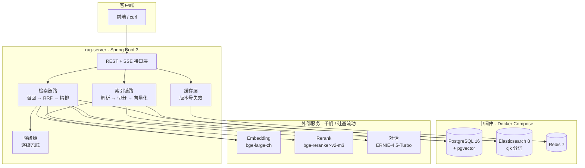
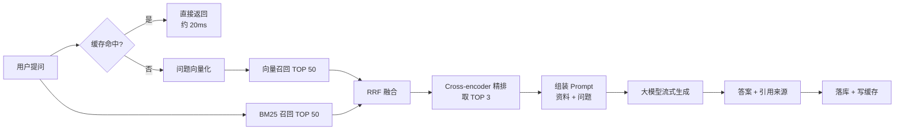

# RAG 知识库问答系统

一个用 Java 实现的检索增强生成(RAG)系统:上传企业文档,用自然语言提问,
系统从文档里找出依据、生成带引用来源的回答。

基于 Spring Boot 3 + PostgreSQL/pgvector + Elasticsearch,支持中英文混合检索、
多路召回融合、Cross-encoder 精排、SSE 流式输出与 Redis 缓存。

---

## 核心特性

| 能力 | 说明 |
|---|---|
| **多格式文档解析** | txt / pdf / docx / xlsx,按格式分流(Tika 负责二进制格式,纯文本走自研编码探测) |
| **标题感知分块** | 识别「第X章 / 1.1」层级,标题作为面包屑拼进正文,而不是单独成块 |
| **混合检索** | pgvector 向量召回 + Elasticsearch BM25 召回,各取 50 条 |
| **RRF 融合** | 只用排名不用分数,绕开两种检索分数不可比的问题 |
| **Cross-encoder 精排** | 对候选逐条做相关性判断,从 50 条收敛到 3 条 |
| **引用溯源** | 从答案正文解析 `[1][2]` 标记,只返回**真正被引用**的来源 |
| **流式输出** | SSE 逐字返回,首字延迟从 3.6s 降到 2.6s |
| **问答缓存** | Redis 缓存 + 知识库版本号失效,重复提问从 4.5s 降到 0.02s |
| **多级降级** | 精排 / 大模型 / 单路召回任一失效都有兜底,服务不中断 |
| **效果可评测** | 150 条评测集,支持四种检索配置对比 |

---

## 系统架构



---

## 一次提问发生了什么



**每一步的设计理由都记在 [docs/decisions.md](docs/decisions.md) 里,共 23 条。**
里面有取舍、有实测数据,也有踩过的坑。

---

## 技术栈与选型理由

| 组件 | 选型 | 为什么是它 |
|---|---|---|
| 框架 | Spring Boot 3.5 + JDK 17 | LangChain4j 的主力 starter 编译在 Boot 3 上;Boot 4 的资料和生态都还不成熟 |
| 关系库 + 向量 | PostgreSQL 16 + pgvector | 一个组件同时承担业务数据和向量检索,不用额外运维向量数据库 |
| 关键词检索 | Elasticsearch 8 + **cjk 分词** | 默认的 standard 分析器把中文按单字切开,BM25 会失效;cjk 按二元组切分且**不用装插件** |
| 缓存 | Redis 7 | 缓存 + 后续可扩展限流 |
| 文档解析 | Apache Tika 3.2 | 覆盖 pdf/docx/xlsx,且按**文件头**识别格式而非扩展名 |
| LLM 编排 | LangChain4j 1.20 | 提供 `EmbeddingModel` / `ChatModel` 抽象,换供应商只改配置 |
| 向量模型 | 千帆 `bge-large-zh`(1024 维) | 中文检索效果好,走 OpenAI 兼容接口 |
| 精排模型 | 硅基流动 `bge-reranker-v2-m3` | 568M 参数,快且便宜;8B 级别的模型对精排这种高频小批量调用不划算 |
| 对话模型 | 千帆 `ernie-4.5-turbo-128k` | RAG 里模型的任务是读懂资料 + 组织语言,不需要最强推理 |
| 表结构管理 | Flyway | 分块表含 `vector` 类型,JPA 自动建表走不通;Flyway 有版本记录、可追溯 |
| 部署 | Docker Compose | 一条命令拉起全套依赖 + 应用本身 |

---

## 快速开始

### 前置条件

- JDK 17
- Docker Desktop(Windows 需要启用 WSL2)
- 两个 API Key:
  - [百度智能云千帆](https://cloud.baidu.com) —— 向量 + 对话
  - [硅基流动](https://siliconflow.cn) —— 精排

### 一、填密钥

复制 `rag-server/application-local.yml`,把你的 Key 填进去:

```yaml
rag:
  embedding:
    api-key: 你的千帆 API Key
  rerank:
    api-key: 你的硅基流动 API Key
```

**这个文件在 `.gitignore` 里,不会被提交。** 它也**不在 `src/main/resources` 下**——
放那里会被打进构建产物,密钥就跟着 jar 走了。

### 二、启动

**最简单的方式**——双击项目根目录的 `start.cmd`,它会自动完成下面三件事:
启动 Docker Desktop → 等后端所有依赖就绪 → 启动前端并打开浏览器。

**或者手动来:**

```bash
# 只启动中间件(本地开发,应用在 IDEA 里跑)
docker compose up -d postgres elasticsearch redis

# 或者连应用一起启动(完整部署)
docker compose up -d
```

第一次启动要下载镜像,大约 3~10 分钟。

### 三、验证

```bash
# 健康检查:应该看到 PostgreSQL / Redis / Elasticsearch / 两个 API Key 全是 UP
curl http://localhost:8080/api/system/health

# 上传一份文档
curl -F "file=@sample-data/星海科技差旅管理办法.pdf" http://localhost:8080/api/documents

# 提问
curl -X POST http://localhost:8080/api/chat \
  -H "Content-Type: application/json" \
  -d '{"question":"出差住宿能报多少?","sessionId":null}'
```

---

## 测试素材

`sample-data/` 下有两套文档,都可以直接拖进前端导入:

| 目录 | 内容 | 用途 |
|---|---|---|
| `sample-data/` | 6 份「企业制度」文档 | 通用问答演示 |
| `sample-data/tech-kb/` | 6 份「技术团队知识库」文档 | **专门用来测检索精度** |

第二套是刻意设计过的 —— 里面有大量**相似但不同**的内容,用来检验检索能不能分得清:

| 干扰项 | 埋在哪 |
|---|---|
| 支付超时 **30 秒** vs 退款超时 **60 秒** | 支付网关接口规范 |
| 错误码 **3001** 余额不足 vs **3002** 额度超限 | 接口规范 + 排查手册 |
| 测试环境 **3** 实例 vs 生产环境 **12** 实例 | 发布流程与回滚预案 |
| `t_payment`(业务数据)vs `t_payment_log`(流水日志) | 数据库表结构说明 |

实测下来这些干扰项都能被正确区分。**如果换成朴素的单路检索,这些数字很容易搞混。**

另外 `tools/ask.py` 是一个批量提问脚本(用 Python 是为了避开命令行传中文的编码问题):

```bash
python tools/ask.py
```

### 验证系统是否正常

双击项目根目录的 **`verify.cmd`**,它会跑完五组检查并给出结论:

| 检查 | 内容 |
|---|---|
| 1. 后端与依赖 | 五个依赖是否全部 UP |
| 2. 知识库内容 | 文档与分块数量 |
| 3. **检索精度** | 六个带干扰项的问题,答案必须命中预期关键词 |
| 4. **防幻觉** | 问一个知识库里没有的问题,必须回答「没有找到」 |
| 5. **缓存** | 同一问题问两次,第二次耗时应降到 500ms 以内 |

---

## 前端界面


**技术选型:Vue 3 + Vite + TypeScript + Tailwind CSS 4**

没有用组件库(Element Plus / Ant Design Vue)。理由:它们的默认样式偏管理后台风,
想做精致还得大量覆盖;而纯 Tailwind 自研组件的视觉完全可控,
也不会出现"面试官没听过这个库"的尴尬。

**四个值得一提的实现点:**

| 点 | 说明 |
|---|---|
| **SSE 手动解析** | `EventSource` 只支持 GET,而提问要带 JSON body,所以用 `fetch` + `ReadableStream` 自己解析 SSE 帧,并且要处理"一帧被切成两次 read"的边界情况 |
| **Markdown 渲染 + XSS 清洗** | 渲染的是「上传的文档 → 大模型复述」的内容,只要有人在文档里写 `<script>` 就可能被原样执行。所以 marked 之后必须过一遍 DOMPurify |
| **打包体积优化** | `highlight.js` 默认入口会打进 190 多种语言的语法定义;换成 `lib/common` 后包体从 1.08MB 降到 316KB |
| **降级状态可见** | 后端把 `degraded` 标记一路传上来,前端就不能藏起来 —— 用户有权知道自己看到的是完整链路的结果还是降级产物 |

**本地开发:**

```bash
cd web
npm install
npm run dev        # http://localhost:5173
```

Vite 已经把 `/api` 代理到 `localhost:8080`,后端跑起来就能直接用。

---

## 接口清单

| 方法 | 路径 | 说明 |
|---|---|---|
| POST | `/api/documents` | 上传文档(multipart),自动解析 + 切分 + 向量化 + 建索引 |
| GET | `/api/documents` | 分页列出文档 |
| POST | `/api/documents/{id}/reindex` | 按当前分块策略重新索引 |
| DELETE | `/api/documents/{id}` | 删除文档(同时清理 ES 索引、磁盘文件,并让问答缓存失效) |
| POST | `/api/chat` | 提问,返回答案 + 引用来源 |
| POST | `/api/chat/stream` | 提问,**SSE 流式返回** |
| GET | `/api/system/health` | 依赖自检 |
| GET | `/api/search/bm25` | 调试:仅 BM25 召回 |
| GET | `/api/search/hybrid` | 调试:多路召回原始结果 |
| GET | `/api/search/fused` | 调试:RRF 融合后排名 |
| GET | `/api/search/reranked` | 调试:完整链路结果 |

### 流式接口的事件序列

```
event:meta   data:{"retrievalMs":1482,"hitCount":3}
event:meta   data:{"ttftMs":2638}
event:delta  data:{"text":"出差"}
event:delta  data:{"text":"住宿的"}
...
event:done   data:{"answer":"...","citations":[...],
                   "retrievalMs":1482,"ttftMs":2638,"totalMs":3904,"degraded":false}
```

`degraded` 为 `true` 表示本次结果经过了降级(精排不可用,或大模型不可用)。

---

## 效果评测

150 条中文评测集(65 直接 / 40 改写 / 25 精确 / 20 不可回答),
在 **12 份文档 / 91 个分块** 的语料上,四种检索配置对比,**指标按题型分组统计**:

### 总体

| 配置 | Hit@1 | Hit@5 | MRR | 评测耗时 |
|---|---|---|---|---|
| 仅向量 | 83.1% | 100.0% | 0.9050 | 34s |
| 仅 BM25 | 89.2% | 98.5% | 0.9342 | 1s |
| **混合** | 90.8% | **99.2%** | 0.9436 | 36s |
| **混合 + 精排** | **97.7%** | **100.0%** | **0.9885** | 77s |

### 按题型 —— Hit@1

| 配置 | 直接型 | 改写型 | 精确型 |
|---|---|---|---|
| 仅向量 | 84.6% | 80.0% | 84.0% |
| 仅 BM25 | **98.5%** | 70.0% | 96.0% |
| 混合 | 93.8% | 80.0% | **100.0%** |
| **混合 + 精排** | **98.5%** | **97.5%** | 96.0% |

### 按题型 —— MRR

| 配置 | 直接型 | 改写型 | 精确型 |
|---|---|---|---|
| 仅向量 | 0.9159 | 0.8821 | 0.9133 |
| 仅 BM25 | 0.9923 | 0.8113 | 0.9800 |
| 混合 | 0.9692 | 0.8667 | **1.0000** |
| **混合 + 精排** | **0.9923** | **0.9875** | 0.9800 |

**三条有数据支撑的结论:**

**结论一:两路召回各有明确短板,而且正好互补**

BM25 在**直接型(98.5%)和精确型(96.0%)上都很强**,但在**改写型上只有 70.0%** ——
用户换一种说法提问,它基本找不到。

向量则相反:改写型有 80.0%,比 BM25 高出 10 个百分点 ——
但直接型(84.6%)和精确型(84.0%)都明显不如 BM25。
**语义检索把精确的字面信息压缩掉了**。

**结论二:混合解决的是「找得到」,不是「排得准」**

混合把 Hit@5 从 98.5% 补到了 **99.2%**(召回广度问题基本解决),
Hit@1 只从 89.2% 提到 90.8%,提升 1.6 个百分点 ——
明显小于精排带来的收益(6.9 个百分点)。

原因是 RRF 只用排名不用分数,会把"一路排第一、另一路没召回"的结果往下拉。
**这是 RRF 的固有代价,不是实现缺陷。**

**结论三:精排才是排序质量的关键**

精排把 Hit@1 从 90.8% 拉到 **97.7%**,MRR 从 0.9436 提到 **0.9885**。

其中提升最猛的是**改写型:Hit@1 从 80.0% 直接到 97.5%**,MRR 从 0.8667 到 0.9875。
这正是 Cross-encoder 最擅长的场景 —— 它能看到问题和文档的完整交互,
而不是像双塔模型那样各自压成一个向量再比距离。

**这三条结论正好对应架构的三层:召回广度 → 融合 → 排序精度。**

分块参数也是在这套评测集上验证的。`max-size=120` 原本是在 6 份文档的语料上调出来的,
语料扩充到 12 份之后**原样重跑了一遍:倒 U 型结论不变,120 仍然最优** ——
61 块 / 91 块 / 208 块 分别对应 Hit@1 96.9% / 97.7% / 96.2%。
重跑脚本见 `tools/chunking-experiment.sh`。

> **关于评测的诚实说明**
>
> 这一版数字是在 **12 份文档 / 91 个分块** 的语料上跑的。
> 更早的一版报告只有 6 份文档 / 45 个分块,四个配置的 Hit@1 分别是
> 84.6% / 92.3% / 92.3% / 98.5% —— 语料翻倍之后**全部下降**。
> 这是任务变难的正常结果,不是检索退化。
> **引用这些数字时必须带上语料规模,否则没有意义。**
>
> 「混合」这一档的 Hit@1 在不同索引状态下会在 90.8% 与 91.5% 之间跳(差 1 道题),
> 两个数字都可复现。单路和精排后的指标则完全稳定。
> 在 130 题的样本上,1 道题就是 0.8% —— 这个量级属于小样本的正常波动。
>
> Hit@5 四种配置都在 98% 以上,说明这个任务对当前语料**偏简单,存在天花板效应**。
> 真正的区分度体现在 Hit@1 和 MRR 上。
>
> 语料是合成的、规模也小,这些数字**不能直接外推到生产环境**。
> 这套评测的价值在于:它证明了改造方向是对的,而且给出了可复现的对比方法。
>
> 完整的分析和已知局限在 `eval/analysis.md`,机器生成的指标快照在 `eval/report.md`
> —— 两份分开,重跑评测只会覆盖后者,不会把人写的分析冲掉。

复现方式:在 IDEA 里直接运行 `EvaluationRunner`(需要 `local` profile),
或者用命令行跑 `EvaluationMain`。指标写进 `eval/report.md`(含拒答阈值校准),
分析与结论在 `eval/analysis.md`。

---

## 项目结构

```
.
├── docker-compose.yml          # 一键拉起中间件 + 应用
├── README.md
├── docs/
│   └── decisions.md            # 23 条技术决策记录(面试弹药)
│   └── troubleshooting.md      # 环境踩坑记录
├── eval/
│   ├── questions.jsonl         # 150 条评测集
│   └── report.md               # 最新评测报告
├── sample-data/                # 测试文档(5 种格式)
├── web/                        # Vue 3 前端
│   └── src/
│       ├── api/                # 接口封装 + SSE 流式解析
│       ├── components/         # 界面组件
│       └── composables/        # 状态逻辑
└── rag-server/                 # Java 应用
    ├── Dockerfile
    ├── application-local.yml   # 本地密钥(已 gitignore)
    └── src/main/java/cn/ragserver/
        ├── document/           # 上传、解析、分块、索引
        ├── retrieval/          # 召回、RRF 融合、检索链路
        ├── rerank/             # 精排
        ├── search/             # Elasticsearch 集成
        ├── embedding/          # 向量模型
        ├── chat/               # 问答、流式、引用
        ├── cache/              # Redis 缓存
        ├── health/             # 健康检查
        ├── eval/               # 评测脚本
        └── config/             # 线程池等基础设施
```

---

## 设计决策

完整的 23 条决策记录在 **[docs/decisions.md](docs/decisions.md)**,
每条包含:做了什么、为什么这么做、备选方案、实测数据、以及面试可能被追问的问题。

按主题分:

| 主题 | 相关决策 |
|---|---|
| 基础设施 | 用 Docker Compose 编排、Flyway 管表结构、用 HNSW 而非 IVFFlat |
| 工程规范 | 统一异常处理、健康检查两层设计、分页与删除的一致性顺序 |
| **检索核心** | 标题感知分块、两路召回、RRF 融合、Cross-encoder 精排 |
| 效果验证 | 150 条评测集、四配置对比、分块参数调优实验 |
| 性能与可用性 | SSE 流式、Redis 缓存 + 版本号失效、多级降级链 |

---

## 如果上生产要改什么

这一节是主动交代不足。**能说清楚"哪里不能上生产"比假装完美更可信。**

| 项目 | 当前做法 | 生产环境应该 |
|---|---|---|
| **向量库** | PostgreSQL + pgvector,单机 | 数据量上百万后换专用向量库(Milvus / Qdrant),或至少做读写分离 |
| **关键词检索** | ES 内置 `cjk` 分析器 | 换 **IK 分词器**,并加载业务词典 —— 分词准确度会有明显提升 |
| **文件存储** | 本地磁盘挂载卷 | 换对象存储(MinIO / 阿里云 OSS),支持多实例共享 |
| **密钥管理** | 本地配置文件只读挂载 | KMS / 密钥管理服务,配合定期轮换 |
| **缓存** | 只做精确匹配 | 加语义缓存(需先解决误命中风险的评估),并暴露命中率监控 |
| **降级演练** | 靠传无效密钥手动触发 | 专门的故障注入开关,**定期演练降级路径** —— 没演练过的降级等于没有降级 |
| **可观测性** | 日志 | 接入 Prometheus 指标(检索延迟、缓存命中率、各依赖错误率)+ 链路追踪 |
| **评测** | 离线跑脚本 | 接入 CI,每次改动自动跑回归,指标下降就拦住 |

---

## 已知局限

1. **语料是合成的、规模小**(12 份文档 / 91 个分块),
   评测数字**不能直接外推到生产环境**。
2. **存在天花板效应**:Hit@5 四种配置都接近或达到 100%,
   区分度主要靠 Hit@1 和 MRR。
3. **语义缓存未实现**:只做归一化后的精确匹配,
   换个说法提问不会命中缓存。这是刻意的保守取舍(避免误命中),不是遗漏。
4. **流式请求无法取消**:客户端断开后模型仍在继续生成。
   LangChain4j 的流式接口没有提供取消机制。
5. **拒答阈值试过了,结论是不接入**:我用 20 道不可回答题 + 130 道可回答题
   校准了精排分数阈值 —— 它在调参集上误答率 0%,**到了验证集却是 40%**;
   而且收益上限只有 1 道题,代价最高 7 道题。
   **20 道不可回答题的样本太小,阈值定不出来**,所以没有接入链路。
   目前的兜底是 Prompt 约束(资料里没有就让模型直说),这条路实测有效。
   详见 `eval/analysis.md` 的「拒答阈值校准」一节。
6. **`IDENTITY` 主键导致无法批量插入**:实测分块入库只占总耗时 2~8%,
   评估后决定不优化(详见决策记录 023)。

---

## Demo 演示清单

如果要给别人演示(或录一段 3 分钟的视频),按这个顺序走,能覆盖所有核心能力:

1. **启动** —— `docker compose up -d`,展示一条命令拉起全套
2. **健康检查** —— 访问 `/api/system/health`,展示四个依赖的状态
3. **上传文档** —— 传一份 PDF,看它自动解析 + 切分 + 向量化
4. **提问(文档里有)** —— 看 **SSE 逐字输出** + 引用来源
5. **提问(文档里没有)** —— 看它如实回答「资料中没有找到相关内容」
6. **再问一遍同样的问题** —— 看缓存秒回(4.5s → 0.02s)
7. **删掉文档再问** —— 看缓存正确失效、答案不再引用已删内容

第 5 和第 7 步是别人最容易忽略、也最能体现工程严谨性的两个点。
